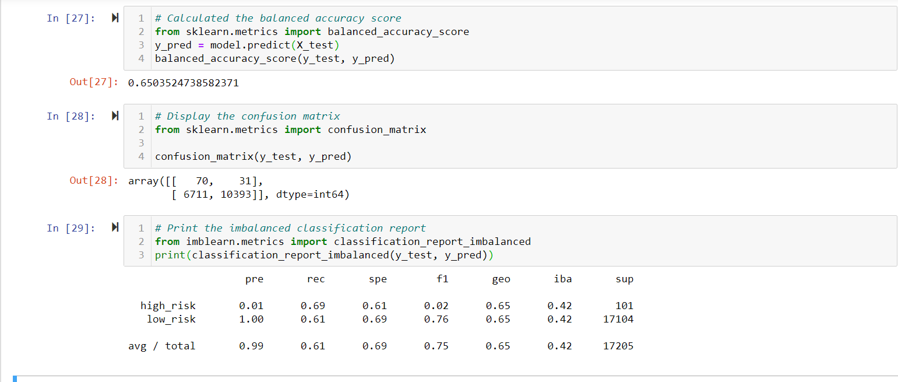
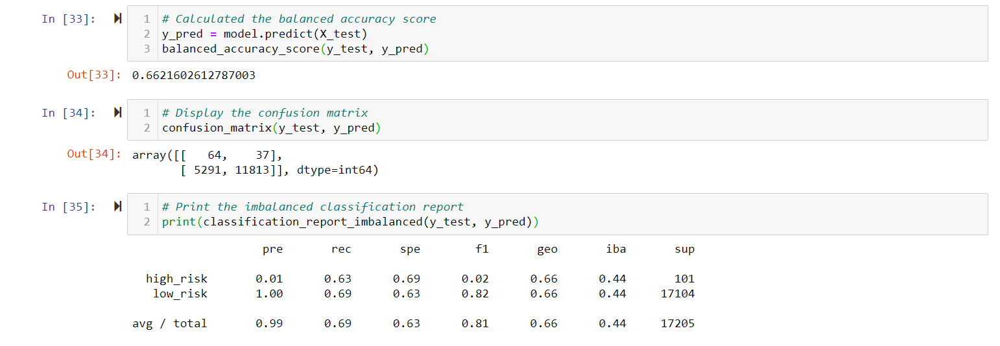
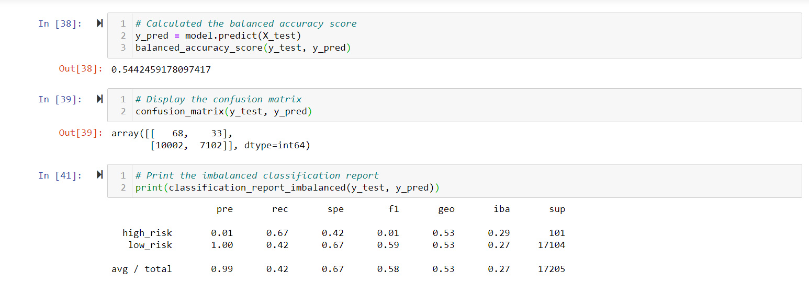
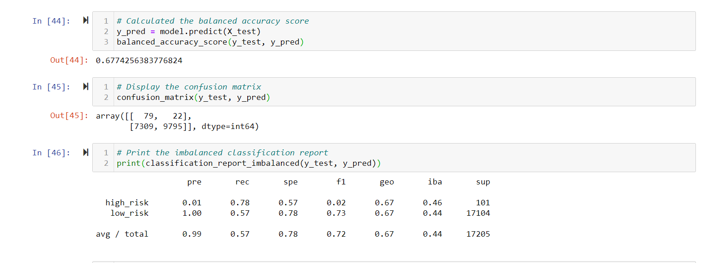
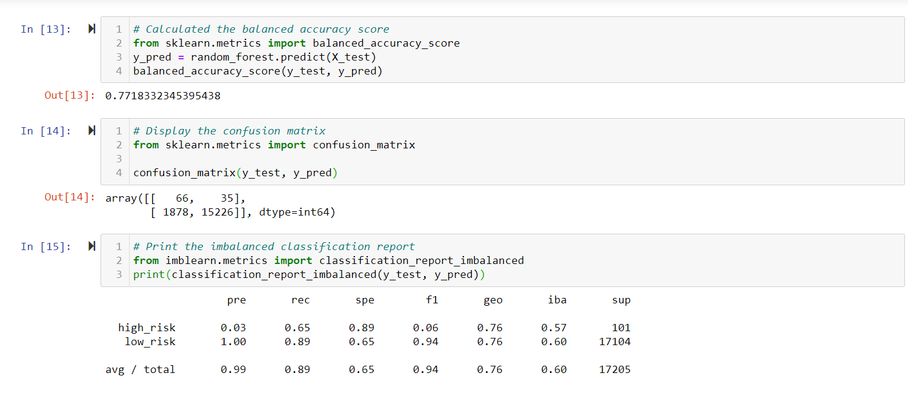
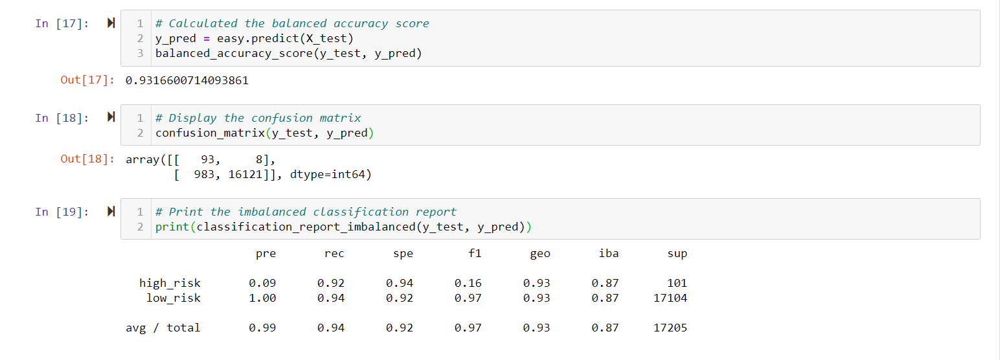

# Credit_Risk_Analysis

## Overview of the Analysis 

Credit Risk is inherantly difficult to predict since there are many features that can contribute to a good or a bad loan rating. For the purposes of this project we analyzed a csv dataset from a lending company called LendingClub to help us predict if someone is low or a high risk loan recipient. Supervised Learning was used to build models and then build predictions from the models we trained from the data in our dataset. In this project we used imbalanced-learn and scikit-learn libraries to build models and evaluate them using a resampling method. We first oversampled the data using the randomoversampler and smote algorithms. Following that we undersampled the data with the clustercetroid algorithm. Finally in the remaining models we used a combination approach to over and undersample the data using smoteenn. After looking at our balanced accuracy score and imbalanced classification report we evaluated the performance of these models and have a written recommendation on which should be used to predict credit risk.

## Results

- Naive Random Oversampling Results: Our balanced accuracy test is only 65%. The Precision for the high risk loans are very low with 1%, so this model will no be able to capture the true positives for high risk loans. The recall for the high risk loan is 69%. 

  

- SMOTE oversampling results: The accuracy score after oversampling using SMOTE is 66% which is also low. The precision for the high risk loans are also low with 1% and the recall is 63%.

  
  
- Undersampling: The balanced accuracy score is 54%, which is lower than the other models. The precision is 1% for high risk loan and the recall is 67%.

   

- Combination(over and undersampling): The balanced accuracy score is 67%. The precision is also low for high risk loan with 1%  and the recall is high with 78%.

  
  
- Balanced Random Forest Classifier: The accuracy score is 77%, which is sligtly higher than other ones and the precision for high risk loan is 3% and the recall is 65%.

  
  
- Easy Ensemble AdaBoost Classifier: The accuracy score is 93%, which is the highest among all the resample methods we have used. The precision for the high risk loan is 9% and recall is 92%. 

  
  
## Summary 

In our analysis the first four models we undersampled, oversampled and did a combination of both to try and determine which model is the best at predicting the loans that are high risk. After that in the next two models we resampled the data using ensemble classifiers to try to predict which loans are high or low risk. Our first four modes have a lower accuracy score than the ensemble classifiers and the recall is also low. Additionally we would want a good balance of recall and precision in our models, therefore taking all these into consideration I would recommend the ensemble classifiers. Easy Ensemble had the best balance of all the models because of its high accuray score and good balance or precision and recall scores, therefore this would be ideal.  
